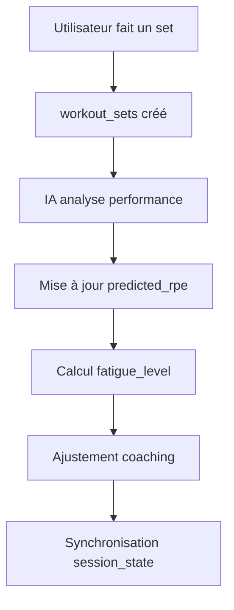

# 🤖 Guide Agents IA - MyFitHero Orchestrator

## ✅ **ÉTAT ACTUEL - PRÊT POUR L'IA**

### **1. Base de Données Configurée**

#### **Tables Disponibles:**
- ✅ `workout_sessions` - **100% IA Ready** (toutes colonnes IA présentes)
- ⚠️ `workout_sets` - **Besoin de 3 colonnes** (`rest_time_seconds`, `technique_score`, `updated_at`)
- ✅ `workout_plans` - Compatible existant
- ✅ `session_metrics` - Compatible existant  
- ✅ `exercises_library` - Compatible existant

#### **Colonnes IA Disponibles:**

**workout_sessions (IA COMPLETE):**
```sql
fatigue_level (0-1)              -- Niveau fatigue utilisateur
performance_score (0-1)          -- Score performance IA
heart_rate_zone (1-5)           -- Zone cardio actuelle
auto_progress_weight (bool)      -- Progression automatique
smart_rest_timers (bool)         -- Repos intelligent activé
real_time_coaching (bool)        -- Coaching temps réel
session_state (jsonb)            -- État session offline
pending_changes (jsonb)          -- Changements en attente
last_sync (timestamp)            -- Dernière sync
```

**workout_sets (3 colonnes à ajouter):**
```sql
-- EXISTANTES:
weight, reps, rpe, predicted_rpe, actual_vs_predicted_performance,
set_start_time, set_end_time, is_dropset, is_failure

-- À AJOUTER avec migration-finale-simplifiee.sql:
rest_time_seconds               -- Temps repos entre sets
technique_score (1-10)          -- Score technique execution
updated_at                      -- Timestamp maj
```

### **2. Composants Sophistiqués Prêts**

#### **SophisticatedWorkoutFlowManager_v2.tsx**
```typescript
// Machine d'état avancée avec IA
import { SophisticatedWorkoutFlowManager } from '@/features/workout/components/SophisticatedWorkoutFlowManager_v2';

// Fonctionnalités IA:
- Prédiction RPE automatique
- Calcul temps repos intelligent
- Coaching adaptatif temps réel
- Synchronisation offline
- Analytics volumétriques
```

#### **Hooks Supabase Compatibles**
```typescript
// Auto-mapping snake_case ↔ camelCase
import { useWorkoutSession, useWorkoutSets } from '@/features/workout/hooks/useSupabaseWorkout';

// Fonctions conversion automatique:
- dbToWorkoutSession() / workoutSessionToDb()
- dbToWorkoutSet() / workoutSetToDb()
```

### **3. APIs Disponibles pour Agents IA**

#### **A. Lecture des Données Utilisateur**
```typescript
// Récupérer profil performance utilisateur
const { session } = useWorkoutSession(sessionId);
const metrics = {
  fatigueLevel: session.fatigueLevel,      // 0-1
  performanceScore: session.performanceScore, // 0-1  
  heartRateZone: session.heartRateZone,    // 1-5
  preferences: {
    autoProgress: session.autoProgressWeight,
    smartRest: session.smartRestTimers,
    coaching: session.realTimeCoaching
  }
};
```

#### **B. Prédictions et Adaptations**
```typescript
// Analyse des sets pour prédictions
const { sets } = useWorkoutSets(sessionId);
const aiInsights = sets.map(set => ({
  predictedRpe: set.predictedRpe,
  actualVsPredicted: set.actualVsPredictedPerformance,
  technique: set.techniqueScore,
  timing: {
    start: set.setStartTime,
    end: set.setEndTime,
    rest: set.restTimeSeconds
  }
}));
```

#### **C. Mise à Jour en Temps Réel**
```typescript
// Agents IA peuvent mettre à jour les métriques
await updateSession({
  fatigueLevel: calculatedFatigue,
  performanceScore: newPerformanceScore,
  heartRateZone: detectedZone,
  sessionState: { aiPredictions: {...} }
});
```

### **4. Orchestrateur IA - Points d'Intégration**

#### **Collecte de Données:**
```typescript
// L'orchestrateur peut accéder à:
1. Données physiologiques (fatigue, performance, cardio)
2. Préférences utilisateur (progression, coaching)  
3. Historique détaillé (sets, timing, RPE)
4. Prédictions vs réalité (apprentissage ML)
5. État synchronisation (offline/online)
```

#### **Actions Recommandées:**
```typescript
// L'IA peut décider:
- Ajustement poids automatique (auto_progress_weight)
- Modification temps repos (smart_rest_timers) 
- Messages coaching (real_time_coaching)
- Prédictions RPE (predicted_rpe)
- Score technique (technique_score)
```

### **5. Flux de Données IA**



### **6. Prochaines Étapes**

#### **Pour Finaliser:**
1. **Exécuter** `migration-finale-simplifiee.sql` dans Supabase
2. **Valider** avec `verify-migration.js`
3. **Tester** les composants avec données réelles
4. **Connecter** l'orchestrateur IA

#### **APIs Prêtes:**
- ✅ Lecture profils utilisateur
- ✅ Écriture métriques IA
- ✅ Prédictions ML
- ✅ Coaching adaptatif
- ✅ Sync offline

---

## 🎯 **RÉSUMÉ POUR AGENTS IA**

**MyFitHero est PRÊT** pour l'intégration d'agents IA sophistiqués avec :

✅ **Données riches** (fatigue, performance, prédictions)  
✅ **APIs compatibles** (hooks TypeScript + Supabase)  
✅ **Composants avancés** (machine d'état, analytics)  
✅ **Architecture évolutive** (offline, real-time, ML)  

**Il ne reste que 3 colonnes à ajouter** dans `workout_sets` pour être 100% opérationnel ! 🚀